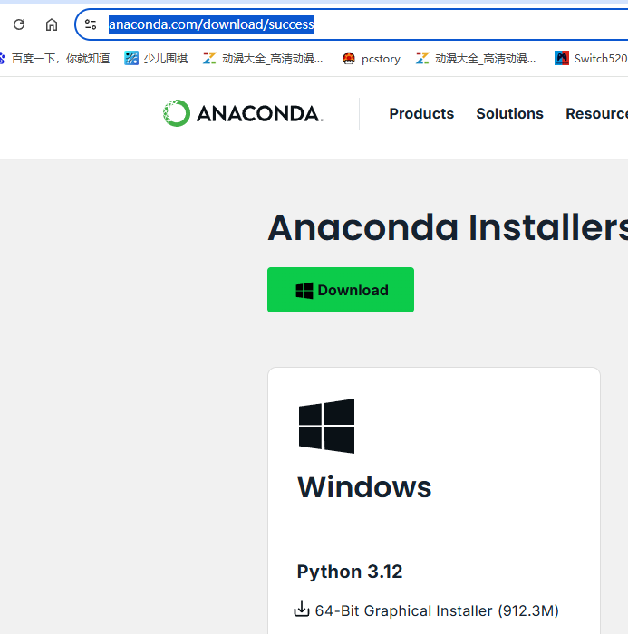
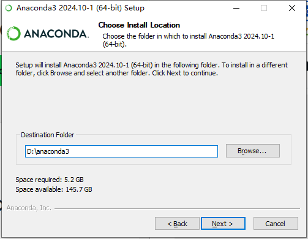
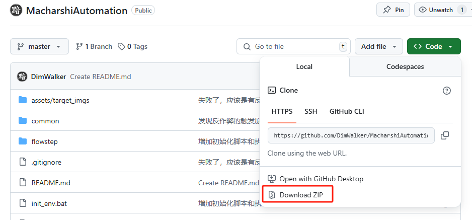
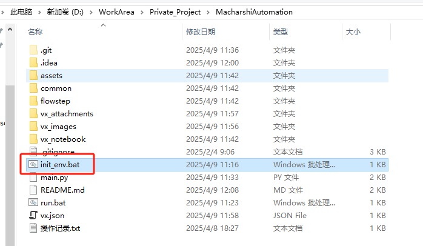
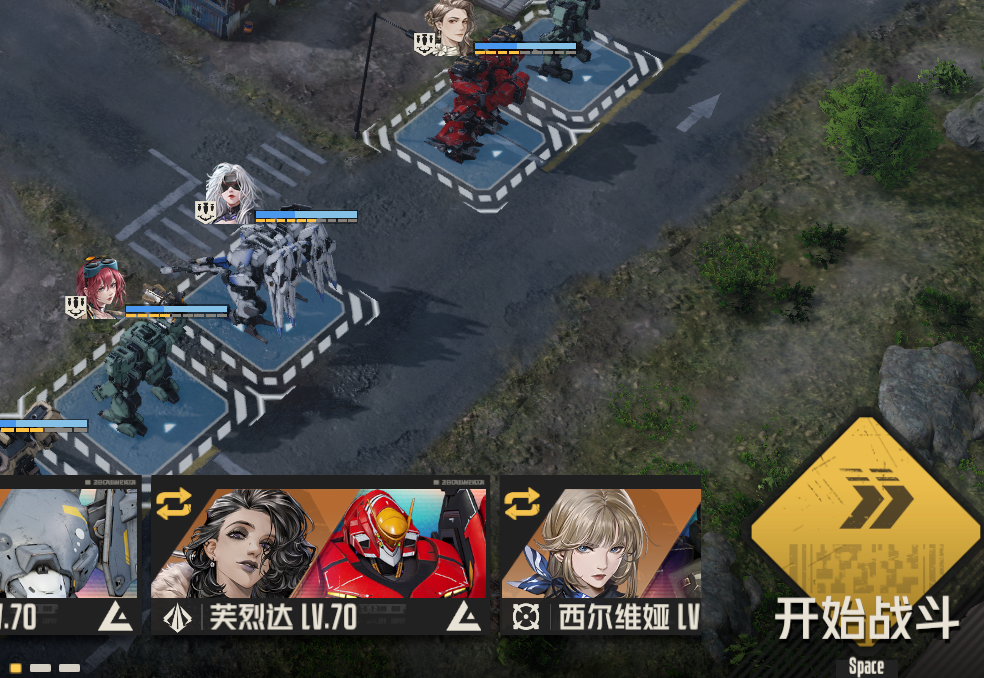
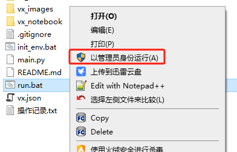

# MacharshiAutomation
* B站演示视频：[https://www.bilibili.com/video/BV1SBdWY8Eyd](https://www.bilibili.com/video/BV1SBdWY8Eyd)
* pyautogui实现钢岚机师解析等级自动化挖矿
* 一般来说，一般来说从等级4升级到等级6，大概有几十钻，部分机师还会解锁徽记
## 
## 叠甲，过
* 我没有做外挂的经验，不知道会不会封号，使用本程序需自行承担风险

## 运行环境
* 运行本程序需要python运行环境，如果你已经有了，可以跳过
* 本人使用anaconda3来管理python虚拟环境，如果你没有这方面的前置知识，可以跟着我下面的步骤操作
* 官网下载地址：[https://www.anaconda.com/download/success](https://www.anaconda.com/download/success)
* 点download

* 安装过程中，将安装路径改为 D:\anaconda3
> 这个安装路径涉及到后面run.bat路径，若你不懂编程，安装路径不要更改，要按我的来


## 下载代码
* 如果你已安装git，那就不用我多说
```
git clone https://github.com/DimWalker/MacharshiAutomation.git
```
* 不懂什么是git，访问这个地址：[https://github.com/DimWalker/MacharshiAutomation](https://github.com/DimWalker/MacharshiAutomation)
> 或许需要魔法才能访问
* 点击Download zip，下载源代码

## 创建python虚拟环境
* 执行init_env.bat，等待创建完成即可

## 运行程序
* 需要先启动钢岚，界面需停留在主界面，战术模拟2-4，或2-4的开始战斗界面，三个中的其中一个

* 右键run.bat，以管理员身份运行

* 默认执行20次战斗，中途不要动鼠标键盘
* 若想中途退出，可按ctrl + shift + s，强制退出